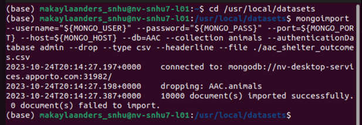
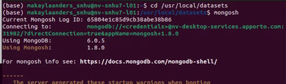
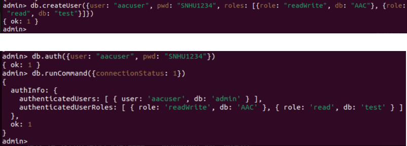

# Animal Shelter Dashboard
This is a dashboard for managing animal shelter data.
This program will maintain a database of animals that categorizes them by breed, age, and name based on the data provided by Grazioso Salvare and their partner animal shelters. 

- [Motivation](#motivation)
- [Features](#features)
- [Usage](#usage)
- [Installation](#installation)
- [Getting Started - Backend](#getting-started---backend)
- [API Usage](#api-usage)
- [Create](#create)
- [Read](#read)
- [Update](#update)
- [Delete](#delete)
- [API Tests](#api-tests)
- [Getting Started - Frontend](#getting-started---frontend)
- [Application Development Process](#application-development-process)

## Motivation
Grazioso Salvare will use this database to identify and train dogs to become rescue search animals to help rescue humans or other animals in danger.

## Features

- Interactive Data Table
- Geolocation Chart
- Pie Chart

## Usage

Use this dashboard to help you find animals that are ready to be trained! You can sort by three major groups of animals fit for rescue missions: water rescue, disaster rescue, and mountain rescue.

## Installation

Python
Python IDE, like Spyder
Jupyter Notebook
aac_shelter_outcomes.csv

## Getting Started - Backend

To get a local copy up and running, follow these simple example steps:
1.	Pull this respository to your local machine.

2. Open a terminal in the project's root folder. and import the aac_shelter_outcomes.csv file by using the following:

3. To make changes, like creating a query or index, a new user must be created. Open a new terminal in the project's root folder and run the mongosh command. This will open the MongoDB shell:

4. Once successfully connected to the Mongosh shell, enter the command **use admin** to switch to the admin database. Then create a user and verify that it’s been connected:

## API Usage

### Create

### Read

### Update

### Delete

## API Tests

## Getting Started - Frontend

## Application Development process