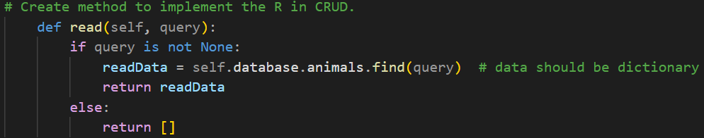
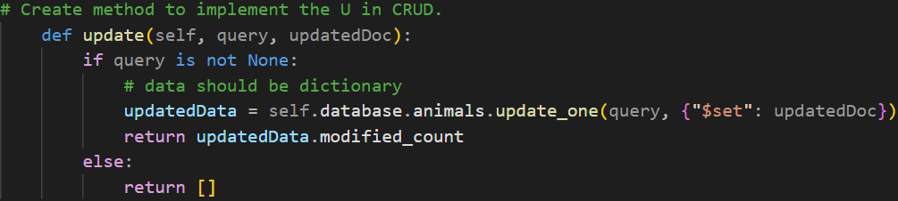
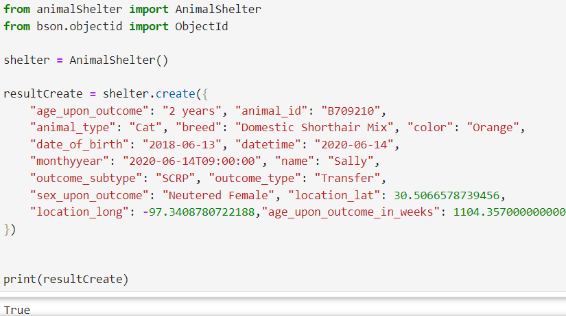

# Animal Shelter Dashboard
This is a dashboard for managing animal shelter data.
This program will maintain a database of animals that categorizes them by breed, age, and name based on the data provided by Grazioso Salvare and their partner animal shelters. 

- [Motivation](#motivation)
- [Features](#features)
- [Usage](#usage)
- [Installation](#installation)
- [Getting Started - Backend](#getting-started---backend)
- [API Usage](#api-usage)
	- [Create API Code](#create-api-code)
	- [Read API Code](#read-api-code)
	- [Update API Code](#update-api-code)
	- [Delete API Code](#delete-api-code)
- [API Tests](#api-tests)
	- [Create Test](#create-test)
	- [Read Test](#read-test)
	- [Update Test](#update-test)
	- [Delete Test](#delete-test)
- [Getting Started - Frontend](#getting-started---frontend)
- [Application Development Process](#application-development-process--lessons-learned)

## Motivation
Grazioso Salvare will use this database to identify and train dogs to become rescue search animals to help rescue humans or other animals in danger.

## Features

- Interactive Data Table
- Geolocation Chart
- Pie Chart

## Usage

Use this dashboard to help you find animals that are ready to be trained! You can sort by three major groups of animals fit for rescue missions: water rescue, disaster rescue, and mountain rescue.

## Installation

- Python
- Python IDE, like Spyder
- Jupyter Notebook

## Getting Started - Backend

To get a local copy up and running, follow these simple example steps:
1.	Pull this respository to your local machine.

2. Open a terminal in the project's root folder. and import the aac_shelter_outcomes.csv file by using the following:

3. To make changes, like creating a query or index, a new user must be created. Open a new terminal in the project's root folder and run the mongosh command. This will open the MongoDB shell:

4. Once successfully connected to the Mongosh shell, enter the command **use admin** to switch to the admin database. Then create a user and verify that it’s been connected:

5. To test the API connection to the database, open the animalShelterTest.ipynb file in Jupyter Notebooks.

## API Usage
Use the CRUD API to find, add, update, or delete animals listed in the csv file. 

Note: Keys like the username, password, port, etc are already in the code and should require no additional authentication keys as the authentication string is “hard coded”.

Code Example

### Create API Code

### Read API Code

### Update API Code

### Delete API Code

## API Tests
To test the API’s functions, run the command **jupyter notebook** in a new terminal (in project's root folder). Once Jupyter Notebook opens the folder, open the animalShelterTest.ipynb file.

### Create Test

The following is an example of a test on the Create API that reads and returns a specific query from the database. If the creation was successful, true will be returned and if not, false will be returned. 

### Read Test

The following is an example of a test on the Read API that searches the animals database for a given query and returns all matching results. If there are no results or the query is incorrect, an empty document will be returned. 

### Update Test
The following is an example of a test on the Update API that creates and adds a new object to the database and returns the number of documents that were deleted. If the update submission is unsuccessful, an empty document will be returned.

### Delete Test
The following is an example of a test on the Delete API that creates and adds a new object to the database and returns the number of documents that were deleted. If the delete submission is unsuccessful, an empty document will be returned.

## Getting Started - Frontend
To get a local version of the dashboard up and running, go back to the jupyter notebook screen. Open the animalShelter.ipynb file and run the cell. A new window will open and the app will be running on http://127.0.0.1:8050. Below is a screencast of what the dashboard looks like. 

On the top left, users have the option of sorting the data by looking at breeds good for water, mountain, and disaster rescues. There’s also the option to click reset to get access to all animals data. The data table displays animal info from the csv file based on the filter (radio button) chosen. 

On the bottom left is a pie chart that displays the percentage of breeds in each filter. On the bottom right is a map that displays the location of the animal selected. To select an animal, click the radio button in the left most column that matches’ the animal you want to see. When users click on the blue pin for the location, the animal’s name and breed will also show up.

## Application Development Process / Lessons Learned
I developed this application in a Client/Server development course. We used Python and MongoDB for the database. I started this project by completing the backend/CRUD API first in a python file. It helped me get familiar with how to query using MongoDB as well as the kinds of queries it was possible to make. Once I switched to the frontend and making the dashboard, I had a much easier time understanding how to make queries and get the right data displayed. 

To make creating dynamic charts and tables easier, I used Dash, a python framework. I simply had to call the necessary component, like Graph, and pass my data for it to be immediately displayed in a chart. I heavily utilized the following two sites/guides to help with building the dashboard:
	
 https://dash.plotly.com/tutorial
	
 https://www.mongodb.com/docs/manual/crud/ 

Creating the dashboard was not easy at first. I had trouble connecting the radio buttons to the main data table. I had to start over multiple times and take the code line by line and test that the code was working as intended on the dashboard before trying to add another feature. Once I broke it down enough to understand how to send data to the appropriate functions for the charts on the dashboard, I was able to finish with relatively few issues. One of the smaller issues I had is: at one point I had a fully working chart and map but would sometimes get an error for not having a default row selected for the map to display a location. I reached out to my professor, and it was an easy fix. 
